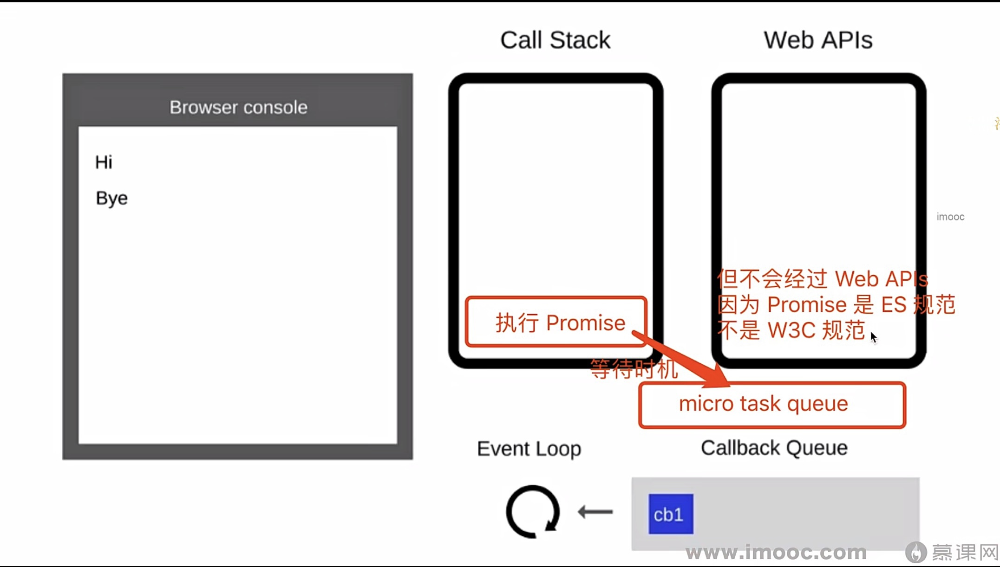
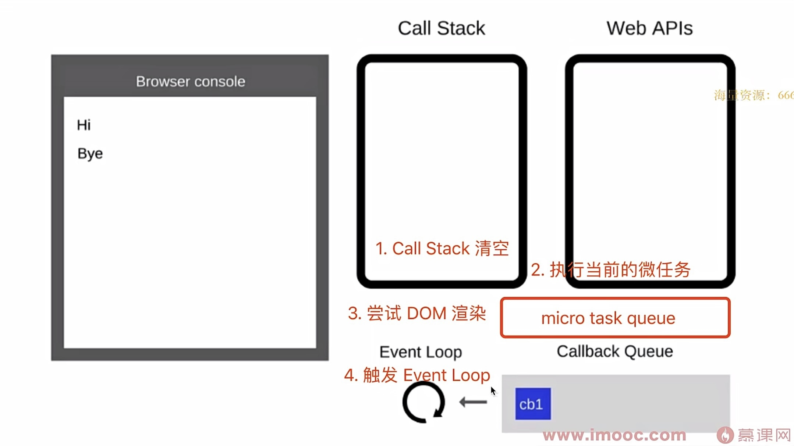
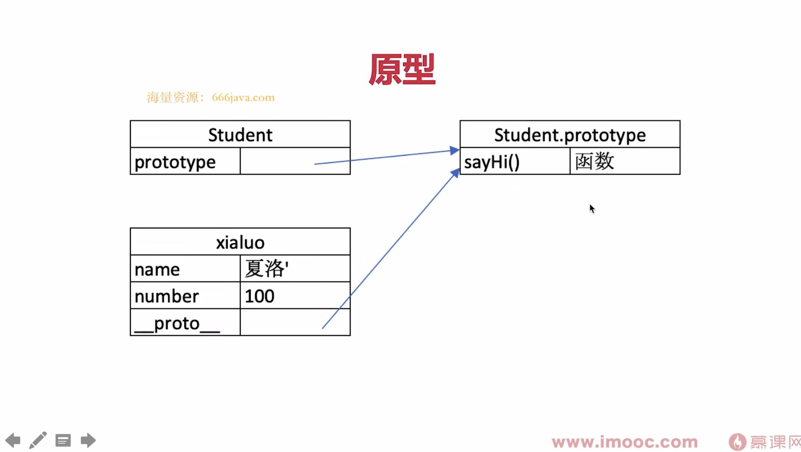
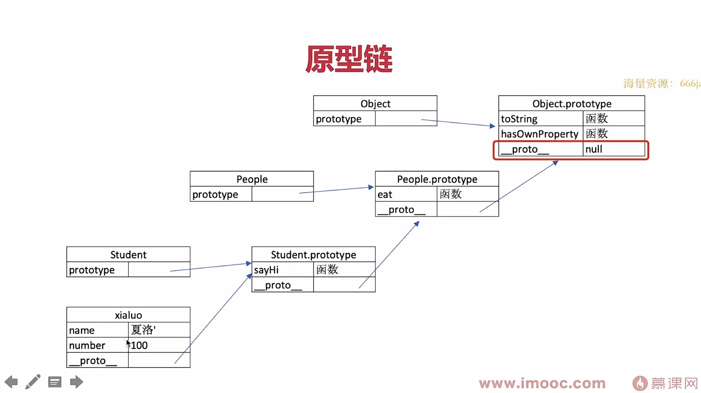

## 原理到proxy响应式的实现，和vu2的不同

查看视频：

[https://www.bilibili.com/video/BV1424y1H7yx/?spm_id_from=333.999.0.0&vd_source=e8e1a370c2eb84bc4d7e2f19e718d114](https://www.bilibili.com/video/BV1424y1H7yx/?spm_id_from=333.999.0.0&vd_source=e8e1a370c2eb84bc4d7e2f19e718d114)

## async/Promis的关系

- 执行async函数，返回的是Promise对象

  

- await相当于Promise的then

  

- try...catch可捕获异常，代替了Promise的catch

## Js的设计模式


## for in 和for of的区别


## ES6的循环遍历


## $netxTike原理

https://juejin.cn/post/7177681326861418556


## 手写promise

- 手写promise是一个经常考察的问题，它不是是十几行代码就能解决完的，至少需要几十行代码。

- 非常常用的API。

- promise有一个叫做promise  a+ 的规范的代码：
  - 手写的话不现实，
  - 完全手写没必要，写了之后也不会使用。
  - 主要是为了考察你的编码能力

  
  
  
  
  
  
  

## 深拷贝

  ```javascript
  // 深拷贝
  function deepClone(obj = {}) {
      if (typeof obj !== 'object' || obj == null ) {
          // 不是对象或者数组形式，或是 null ，直接返回
          return obj
      }
  
      // 初始化返回结果
      let result
      if (obj instanceof Array) {
          result = []
      } else {
          result = {}
      }
  
      // 变量
      for (let key in obj) {
          if (obj.hasOwnProperty(key)) {
              // 保证不是原型属性（原型和原型链部分会讲解）
  
              // 递归调用
              result[key] = deepClone(obj[key])
          }
      }
  
      // 返回结果
      return result
  }
  
  const obj1 = { x: 100, y: 200 }
  const obj2 = deepClone(obj1)
  obj1.x = 101
  console.log(obj2) // x: 100
  ```

  

##   值类型和引用类型的区别

```javascript
const obj1 = { x: 100 , y: 200 }
const obj2 = obj1
let x1 = obj1.x
obj2.x = 101
x1 = 102

console.log (obj1)
```

## class是语法糖

## 原型 && 原型链

**原型关系：**



- 每个 class都有显示原型 prototype
- 每个实例都有隐式原型 _ proto_
- 实例的_ proto_指向对应 class 的 prototype

**基于原型的执行规则：**

- 获取属性xialuo.name或执行方法xialuo.sayhi()时

- 先在自身属性和方法寻找

- 如果找不到则自动去`_proto_`中寻找

  

  

## 作用域

```javascript
// 函数作为返回值
// function create() {
//     const a = 100
//     return function () {
//         console.log(a)
//     }
// }

// const fn = create()
// const a = 200
// fn() // 100

// 函数作为参数被传递
function print(fn) {
    const a = 200
    fn()
}
const a = 100
function fn() {
    console.log(a)
}
print(fn) // 100

// 所有的自由变量的查找，是在函数定义的地方，向上级作用域查找
// 不是在执行的地方！！！

```


```javascript
if(true) {
  let d = 3
  var c = 3;
}

console.log('2d',d); //不可以跨块访问
console.log('2c',c);//可以跨块访问
```

## 闭包

作用域应用的特殊情况，有俩种表现：

- 函数作为参数被传递

- 函数作为返回值被返回

  

## this中的五种情况

1. 作为普通函数去调用，`this`指向`window`

2. 使用call、apply、 bind的调用模式 （改变函数内this的指向）

   ```javascript
   var target = {
                   name: 'andy'
               }
   
   function fn(a, b) {
   console.log('this: ', this);
   console.log(a + b);
   
   };
   fn.call(target, 1, 2); //改变函数内部this的指向，第一个参数是o对象
   
   //fn.apply(target,[ 1, 2]);
   
   //fn.bind(target, 1, 2)()
   //bind（）会返回一个新函数，然后再去执行
   ```

   

3. 当函数作为对象的方法被调用时，`this`就会指向`该对象`

4. 在class方法中调用，this`指向`返回的这个对象

   ```javascript
   var MyClass = function(){
       this.name = 'sven'
       return {name:'anne'}
   }
   
   var obj = new MyClass();
   console.log(obj.name) // 'anne'
   ```

   

5. 箭头函数

   - 箭头函数this的取值都是取上一级作用域的值

   

**this场景取的值是在函数执行的时候确认，不是在赋值的确认。**

## 手写bind函数

```javascript
function fn1(a, b, c) {
    console.log('this', this)
    console.log(a, b, c)
    return 'this is fn1'
}


// 模拟 bind
Function.prototype.bind1 = function () {

    console.log('arguments是一个对象数组: ', arguments);

    // 将参数拆解为数组
    // console.log([...arguments]);
    //ES5 写法 Array.prototype.slice.call()方法能够将一个具有length属性的对象转换为数组。
    const args = Array.prototype.slice.call(arguments)
    // const args = Array.from(arguments)
    // const args = [...arguments]

    // 获取 this（数组第一项）
    const t = args.shift()

    // fn1.bind(...) 中的 fn1
    const self = this

    // 返回一个函数
    return function () {
        return self.apply(t, args)
    }
}
const fn2 = fn1.bind1({x: 100}, 10, 20, 30)
const res = fn2()
console.log(res)
```

## 同步和异步的区别

1. 基于JS是单线程语言

2. 异步不会阻塞代码

3. 同步会阻塞代码

   