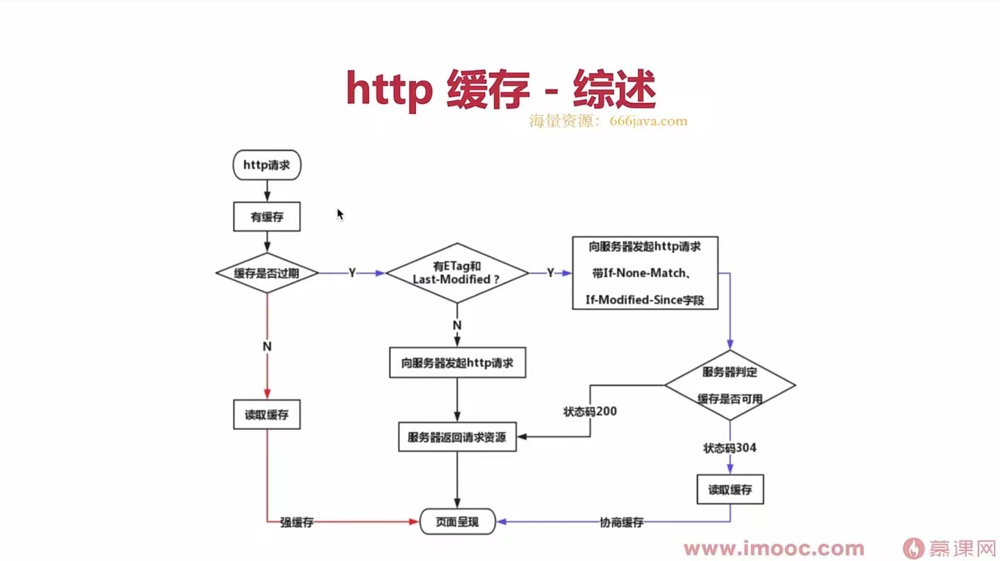

## 状态码分类

1. 1XX服务器收到请求
2. 2XX请求成功，如200
3. 3XX重定向，如302
4. 4XX客户端错误，如404，地址不存在等
5. 5XX服务端错误，如500

## 常见状态码

- 200  请求成功
- 301 永久重定向 （配合location，浏览器自动处理）
- 302 临时重定向  （配合location，浏览器自动处理）
- 304资源未被修改
- 404 资源未找到，发送了一个后端没有的网址
- 403 没有权限，没有登录就去寻找用户信息
- 500 服务器错误
- 504网关超时

## Restful API

- 一种新的API设计方法（早已推广使用）
- 传统API设计：把每个url当作一个功能
- **Restful API设计：把每个url当作一个唯一的资源**
  - **如何设计成一个资源？**
    - 尽量不用url参数
      1. 传统API设计：/api/list?pageIndex= 2
      2. Restful API设计：/api/list/2
    - 用method 表示操作类型(就是让接口地址加上对应的功能，可以让开发者看到这个地址是什么功能)
      1. post 请求   /api/create-blog
      2. patch 请求   /api/update-blog?id=100
      3. get请求    /api/get-blog?id = 100

## http headers

1. Request Headers

2. Response Headers

3. 自定义header

   [http://axios-js.com/docs/#Requesr-Config]: 网站

   以下面的格式显示在请求头：

   ```javascript
   headers: { 'X-Requested-width' : 'XMLHttpRequest'}
   ```

## http缓存

1. 关于缓存的介绍
   
- 静态资源（jss  css  img） 可以被缓存
   
2. http缓存策略（强制缓存+协商缓存）

   **强制缓存：**

   - 缓存可能会过期，会重新请求
      

   - Cache-Control 

     - 存在Response Headers中

     - 控制强制缓存的逻辑

     - 例如 Cache-Control：max-age = 31536000（单位是秒）


   **协商缓存：**

   - 服务器端缓存策略

     服务器端判断这个资源是否可以用缓存的内容

   - 服务器判断客户端资源，是否和服务端资源一样

   - 一致则返回304（代表资源未被修改），否则返回200和最新的资源

   

3. 刷新操作方式，对缓存的影响

   三种操作

   - 正常操作：地址栏输入 url ，点击链接，前进后退等
   - 手动刷新：F5 或者点击刷新按钮
   - 强制刷新：ctrl + F5

   对应的缓存策略  

   - 正常操作：强制缓存有效，协商缓存有效
   - 手动刷新：强制缓存*失效*，协商缓存有效
   - 强制刷新，强制缓存*失效*，协商缓存*失效*

