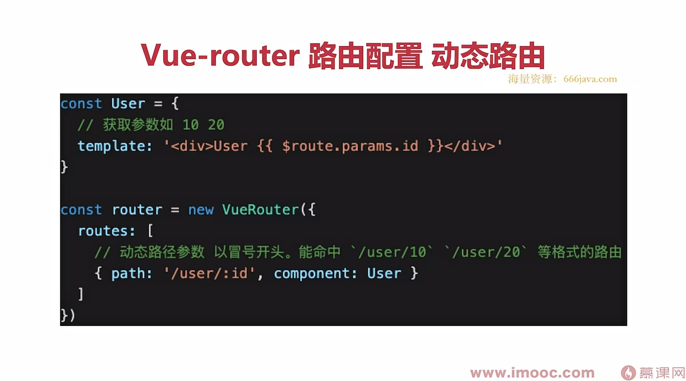
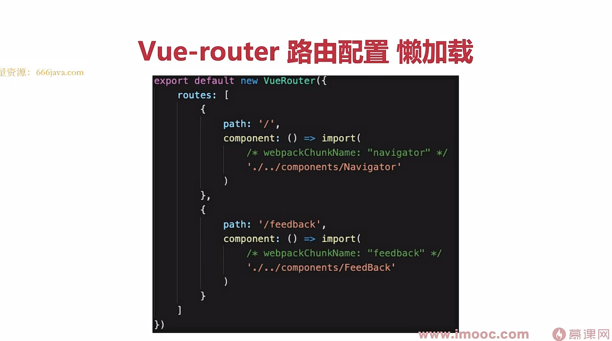
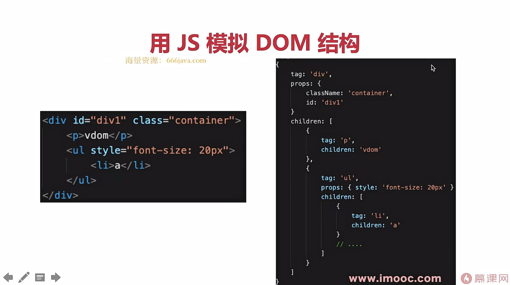
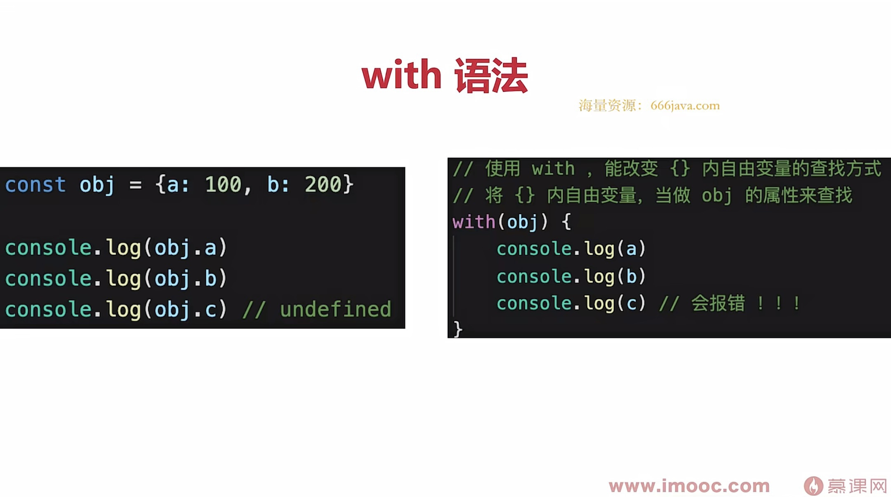
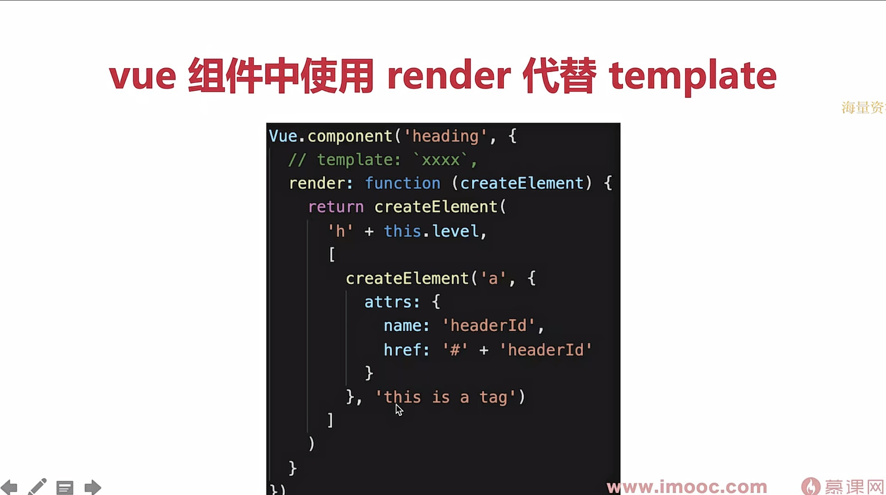
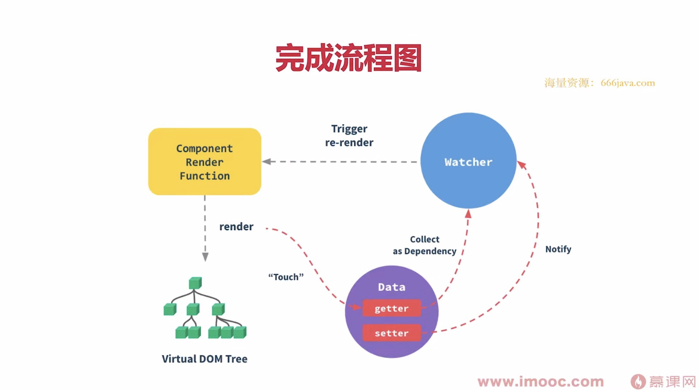

## computed
计算属性在v-model的使用：

```vue
<template>
    <input v-model="double2"/> // 这样子使用必须写get()和set()
</template>

<script>
export default {
    data() {
        return {
            num: 20
        }
    },
    computed: {
        double2: {
            get() {
                return this.num * 2
            },
            set(val) {
                this.num = val/2
            }
        }
    }
}
</script>
```

## watch

- 值是正常类型，可以正常拿到oldvalo
- 值是引用类型，拿不到oldVal，需要深度监听

## eventDemo

1. event是原生的
2. 事件被挂载在当前元素

## 兄弟组件之间的通讯--事件总线

1. 新建`event.js`

   ```javascript
   import Vue from 'vue'
   
   export default new Vue()
   ```

2. 借助父组件来引用两个兄弟组件

   **父组件**

   ```vue
   <template>
       <div>
           <Input @add="addHandler"/>
           <List :list="list" @delete="deleteHandler"/>
       </div>
   </template>
   
   <script>
   import Input from './Input'
   import List from './List'
   
   export default {
       components: {
           Input,
           List
       },
       data() {
           return {
               list: [
                   {
                       id: 'id-1',
                       title: '标题1'
                   },
                   {
                       id: 'id-2',
                       title: '标题2'
                   }
               ]
           }
       },
       methods: {
           addHandler(title) {
               this.list.push({
                   id: `id-${Date.now()}`,
                   title
               })
           },
           deleteHandler(id) {
               this.list = this.list.filter(item => item.id !== id)
           }
       },
   }
   </script>
   ```

   **Input组件：**

   ```javascript
   <template>
       <div>
           <input type="text" v-model="title"/>
           <button @click="addTitle">add</button>
       </div>
   </template>
   
   <script>
   import event from './event'
   
   export default {
       data() {
           return {
               title: ''
           }
       },
       methods: {
           addTitle() {
               // 调用父组件的事件
               this.$emit('add', this.title)
   
               // 调用自定义事件,可以传出参数
               event.$emit('onAddTitle', this.title)
   
               this.title = ''
           }
       }
   }
   </script>
   ```

   **List组件：**

   ```javascript
   <template>
       <div>
           <ul>
               <li v-for="item in list" :key="item.id">
                   {{item.title}}
   
                   <button @click="deleteItem(item.id)">删除</button>
               </li>
           </ul>
       </div>
   </template>
   
   <script>
   import event from './event'
   
   export default {
       // props: ['list']
       props: {
           // prop 类型和默认值
           list: {
               type: Array,
               default() {
                   return []
               }
           }
       },
       data() {
           return {
   
           }
       },
       methods: {
           deleteItem(id) {
               this.$emit('delete', id)
           },
           addTitleHandler(title) {
               // eslint-disable-next-line
               console.log('on add title', title)
           }
       },
   
       mounted() {
           // 绑定自定义事件
           event.$on('onAddTitle', this.addTitleHandler)
       },
       beforeDestroy() {
           // 及时销毁，否则可能造成内存泄露
           event.$off('onAddTitle', this.addTitleHandler)
       }
   }
   </script>
   ```

## $nextTick

- Vue是异步渲染（原理部分会详细讲解）
- data改变之后，DOM不会立刻渲染
- $nextTick 会在DOM渲染之后触发，以获取最新DOM节点

## 动态加载组件

## 异步加载组件

- import() 函数

  ```vue
  <script>
  export default {
      components: {
          FormDemo: () => import('../BaseUse/FormDemo'),
      },
  }
  </script>
  ```

  

- 按需加载，异步加载大组件

## keep-alive

- 缓存组件

- 频繁切换，不需要重复渲染

- `Vue`常见性能优化

## Mixin

-   多个组件有相同得逻辑，抽离出来
- `mixin`并不是完美得解决方案，会有一些问题
  - 变量来源不明确，不利于阅读
  - 多`mixin`可能会造成命名冲突
  - `minxin`和组件可能会出现多对多得关系，复杂度较高
- `Vue3`提出得`Composition API`旨在解决这些问题

## Vuex

Vuex基本概念：

- state
- getters
- mutation
- action

用于Vue组件：

- dispatch
- commit
- mapState
- mapGetters
- mapActions
- mapMutations

## Vue-router使用

- 路由模式（hash、H5 history）
  - hash模式（默认），路由地址有#
  - H5 history模式
  - 后者需要server端支持，因此无特殊需求可选择前者
- 路由配置（动态配置、懒加载import（）函数）
  - 
  - 切换路由就去加载对应的页面，而不是全部加载
    

## Vue响应式

- 核心API-Object.defineProperty

- 如何实现响应式，代码演示

- Object.defineProperty的一些缺点（Vue3.0启用Proxy）

- Proxy兼容性不好，且无法polyfill

## vdom总结

  - 用JS模拟DOM解构（vnode）

    

  - 新旧vnode对比，得出最小的更新范围，最后更新DOM

  - 数据驱动试图的模式下，有效控制DOM操作

## diff算法

新旧vnode对比的过程就是diff。

## 模板编译

- 模板是vue开发中最常用的部分，即与使用相关联的原理
- 它不是html，有指令、插值、JS表达式，到底是什么？
  - 模板不是html，有指令、插值、JS表达式，能实现判断、循环
  - html是标签语言，只有JS才能实现判断、循环（图灵完备）
  - 因此，模板一定是转换为某种JS代码，即编译模板
- 面试不会直接问，但会通过“组件渲染和更新过程”考察


- 前置知识：JS的with语法

  

- vue template complier 将模板编译为render函数

- 执行render函数生成vnode，在渲染和更新

- vue组件可以用render代替template

  

## vue组件时如何渲染和更新的

**初次渲染过程**

- 解析模板为render函数（或在开发环境已完成，vue-loader）
- 触发响应式，监听data属性getter setter
- 执行render函数（会触发getter：因为模板使用到的字段，会从data中取值，就会触发getter），生成vnode，patch（elem，vnode）

**更新过程**

- 修改data，触发setter（此前在getter中已被监听）
- 重新执行render函数，生成newVnode
- patch（vnode，newVnode）

**完整流程图**




  

  

  

  