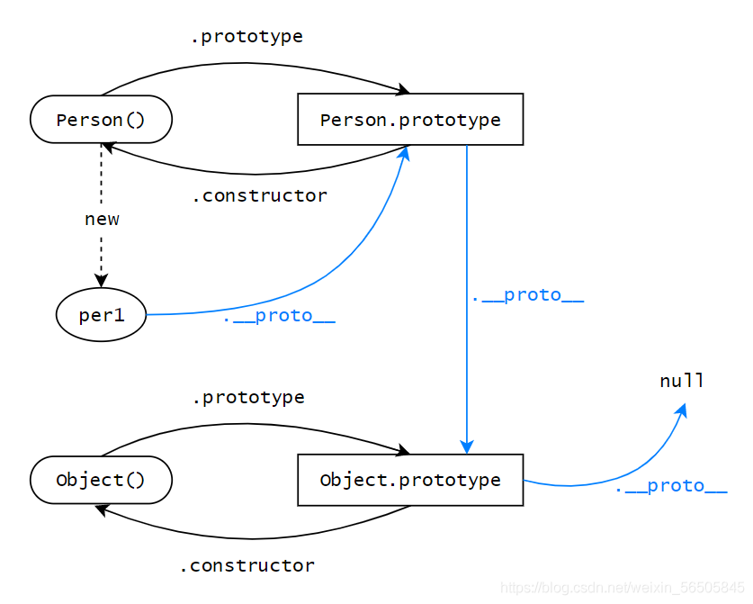
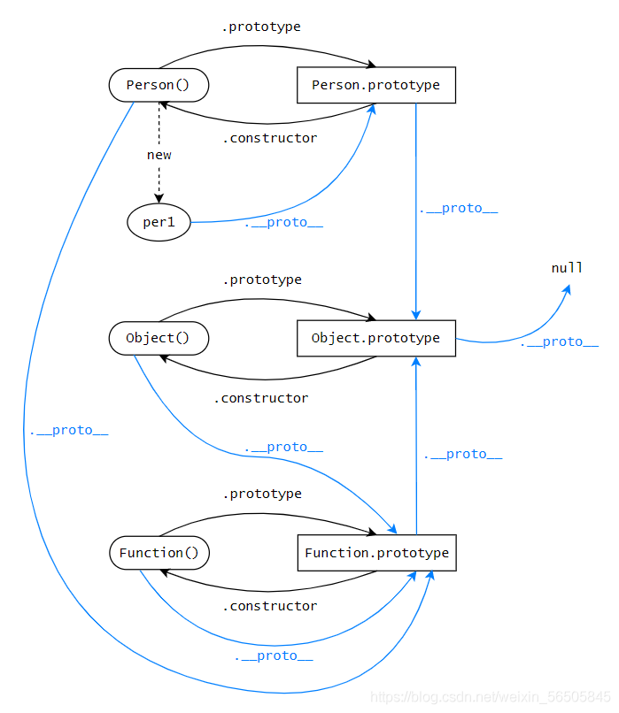

```javascript
js的数据类型
基本数据类型:String、Number、Null、Undefined、Boolean
引用数据类型:Object、Array、Function

当 ES6 问世，直至今日，又新增了两种基本数据类型：Symbol（ES 新增）、BigInt（ES10 新增）

typeof 变量名 可以检测数据类型

Object、Array和Null区分，都返回object
function 返回function
console.log(typeof Symbol)           // function
console.log(typeof Symbol());        // symbol
```

## 构造函数

构造函数和普通函数本质上没什么区别，只不过使用了 new 关键字创建对象的函数，被叫做了构造函数

## 原型对象

在 js 中，每一个函数类型的数据，都有一个叫做 prototype 的属性，这个属性指向的是一个对象，就是所谓的原型对象。
对于原型对象来说，它有个 constructor 属性，指向它的构造函数

## 原型&原型链



```javascript
console.log(per1.proto === Person.prototype); // true
```

可以看出，整个查找过程都是顺着**proto**属性，一步一步往上查找，形成了像链条一样的结构，这个结构，就是原型链。所以，原型链也叫作隐式原型链

## 函数也是一种对象

在 js 中，所有函数都可以看做是 Function()的实例，而 Person()和 Object()都是函数，所以它们的构造函数就是 Function()。Function()本身也是函数，所以 Function()也是自己的实例，听起来既怪异又合理，但是就是这么回事。

```javascript
console.log(Person.constructor === Function); // true
console.log(Object.constructor === Function); // true
console.log(Function.constructor === Function); // true
```

既然知道了函数的构造函数，那么函数的**proto**指向我们也就知道了，就是 Function.prototype

```javascript
console.log(Person.__proto__ === Function.prototype); // true
console.log(Object.__proto__ === Function.prototype); // true
console.log(Function.__proto__ === Function.prototype); // true
```

根据这几个结论，我们就能拓展出一张更大的关系图了：


## 总结

1、构造函数是使用了 new 关键字的函数，用来创建对象，所有函数都是 Function()的实例
2、原型对象是用来存放实例对象的公有属性和公有方法的一个公共对象，所有原型对象都是 Object()的实例
3、原型链又叫隐式原型链，是由**_proto_**属性串联起来，原型链的尽头是 Object.prototype

[[(36 条消息) 原型和原型链*Dinmunh 的博客-CSDN 博客*原型和原型链](https://blog.csdn.net/weixin_56505845/article/details/119683904)](https://blog.csdn.net/weixin_56505845/article/details/119683904)
