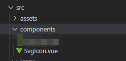
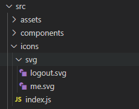

# 安装

## 1、添加依赖

```js
npm install svg-sprite-loader -D
```

## 2、`vue.config.js`

```js
module.exports = defineConfig({
  chainWebpack: (config) => {
    // 添加svg文件
    // set svg-sprite-loader

    config.module
      .rule("svg")
      .exclude.add(resolve("src/icons")) //与svg图片存放的位置有关
      .end();
    config.module
      .rule("icons")
      .test(/\.svg$/)
      .include.add(resolve("src/icons")) //与svg图片存放的位置有关
      .end()
      .use("svg-sprite-loader")
      .loader("svg-sprite-loader")
      .options({
        symbolId: "icon-[name]",
      })
      .end();
  },
});
```

## 3、在`src/components`下编写通用`SvgIcon.vue`组件



```vue
<template>
  <svg :class="svgClass" aria-hidden="true">
    <use :xlink:href="iconName" />
  </svg>
</template>

<script>
export default {
  name: "SvgIcon",
  props: {
    iconClass: {
      type: String,
      required: true,
    },
    className: {
      type: String,
      default: "",
    },
  },
  computed: {
    iconName() {
      return `#icon-${this.iconClass}`;
    },
    svgClass() {
      if (this.className) {
        return "svg-icon " + this.className;
      } else {
        return "svg-icon";
      }
    },
  },
};
</script>

<style lang="scss" scoped>
.svg-icon {
  width: 1em;
  height: 1em;
  vertical-align: -0.15em;
  fill: currentColor;
  overflow: hidden;
}
</style>
```

## 4、在`src`下创建`icons`文件夹，并添加入口文件`index.js`,增加`svg`文件夹存放`svg`文件



`index.js`内容：

```js
import SvgIcon from "@/components/SvgIcon"; // svg组件

const req = require.context("./svg", false, /\.svg$/);
const requireAll = (requireContext) =>
  requireContext.keys().map(requireContext);
requireAll(req);

export default {
  install: (app) => {
    app.component("SvgIcon", SvgIcon);
  },
};
```

5、在`main.js`中把`index.js`引入

```js
import SvgIcon from "./icons";

const app = createApp(App);
app.use(SvgIcon);
```

6、运用方式

```vue
<template>
  <svg-icon
    icon-class="me"
    style="width: 1.5em; height: 1.5em;vertical-align:middle;color:#2263e8"
  />
</template>
```
