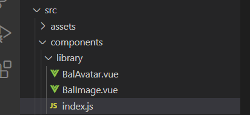

在日常开发中，有一些组件是比较常用，但是为了避免在开发过程中不停地引入，或者在 main.js 中注册，或者每添加一个组件就需要手动注册一次，则需要直接进行自动化全局注册。

## 思路分析

- 使用 `require` 提供的函数 `context` 加载某一个目录下的所有 `.vue` 后缀的文件。
- 然后 context 函数会返回一个导入函数 `importFn`
  - 它有一个属性 `keys()` 获取所有的文件路径
- 通过文件路径数组，通过遍历数组，再使用 `importFn` 根据路径导入组件对象
  遍历的同时进行全局注册即可

## 具体代码

### 1.在 src 的 components 下新建一个文件夹 library，然后再 library 下新建 index.js 文件



index.js 是我们注册的入口文件:

```js
// context(其组件目录的相对路径,是否查询其子目录, 匹配基础组件文件名的正则表达式)
//  ./当前目录下的.vue文件
// 返回值：一个函数，有一个keys属性，这个属性为一个函数，返回值为匹配到的路径数组
// 官方文档https://www.npmjs.com/package/require-context

const importFn = require.context("./", false, /\.vue$/);
// console.dir(importFn.keys()) //文件名称数组
export default {
  install(app) {
    // 批量注册全局组件
    importFn.keys().forEach((key) => {
      // 导入组件
      const component = importFn(key).default;
      // 注册组件
      // component.name 组件需要添加name属性
      app.component(component.name, component);
    });
  },
};
```

### 2.在main.js中引入入口文件，并用use方法使用

```js
import BalUI from '@/components/library/index.js'

app.use(BalUI)
```

