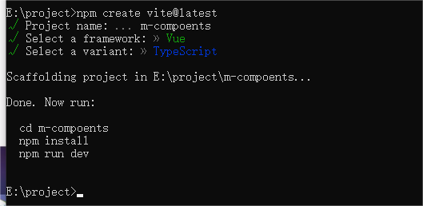

## 搭建第一个 Vite 项目

兼容性注意

Vite 需要 [Node.js](https://nodejs.org/en/) 版本 14.18+，16+。然而，有些模板需要依赖更高的 Node 版本才能正常运行，当你的包管理器发出警告时，请注意升级你的 Node 版本。

使用 NPM:

```javascript
npm create vite@latest
```

然后按照提示操作即可！

示例：



## 修改端口

`vite.config.ts`可指定修改为 8080

```typescript
import { defineConfig } from "vite";
import vue from "@vitejs/plugin-vue";

// https://vitejs.dev/config/
export default defineConfig({
  plugins: [vue()],
  server: {
    port: 8080,
  },
});
```

## 安装路由和组件库

```javascript
npm i -S vue-router@next element-plus
```

## 创建 router 和 views 文件夹

index.js 代码：

```typescript
import { createRouter, createWebHistory, RouteRecordRaw } from "vue-router";

import Home from "../views/Home.vue";
const routes: RouteRecordRaw[] = [
  {
    path: "/",
    component: Home,
  },
];

const router = createRouter({
  routes,
  history: createWebHistory(),
});

export default router;
```

Home.vue 代码

```vue
<template>
  <div>
    首页
    <el-button>Default</el-button>
  </div>
</template>

<script lang="ts" setup></script>

<style lang="scss" scoped></style>
```

## mai.js 注册路由

```javascript
import router from "./router/index";

const app = createApp(App);
app.use(router);
app.mount("#app");
```

## 修改 app.vue

```vue
<template>
  <router-view></router-view>
</template>

<style lang="scss"></style>
```

## 全部引入 element-plus

在`main.js`中：

```javascript
import ElementPlus from "element-plus";
import "element-plus/dist/index.css";

//链式调用
app.use(router).use(ElementPlus);
```

## 安装 sass

```javascript
npm i -D sass sass-loader
```

```css
// app.vue文件中添加
<style lang="scss">
* {
  margin: 0;
  padding: 0;
}
</style>
```

至此已经修改完成框架。

