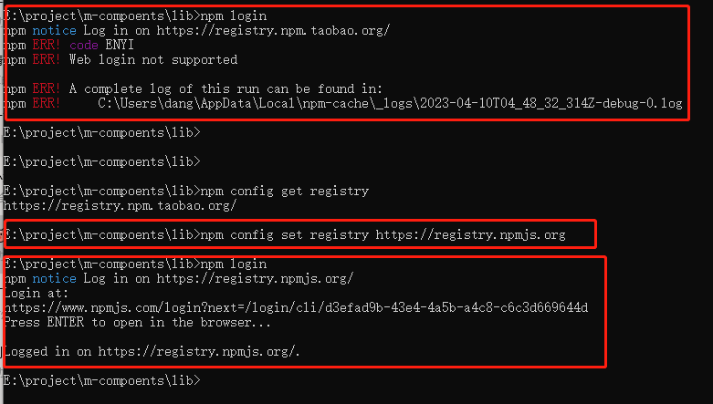
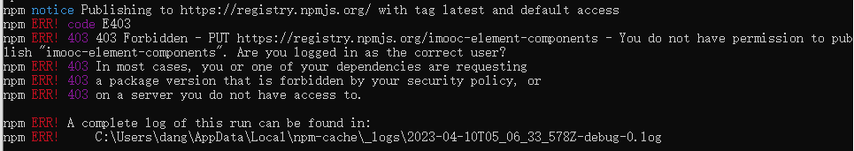
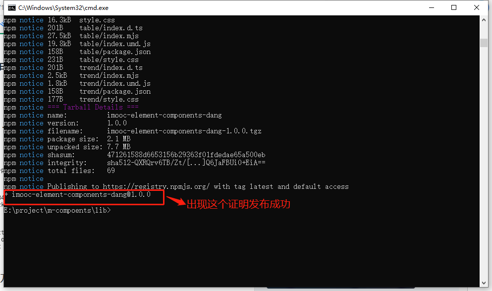
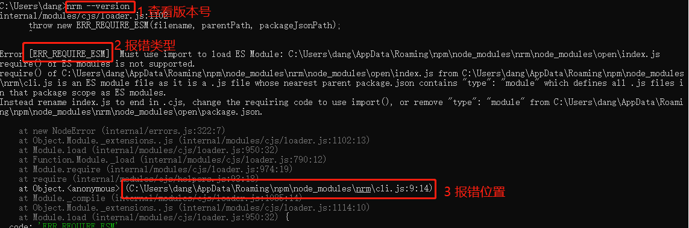
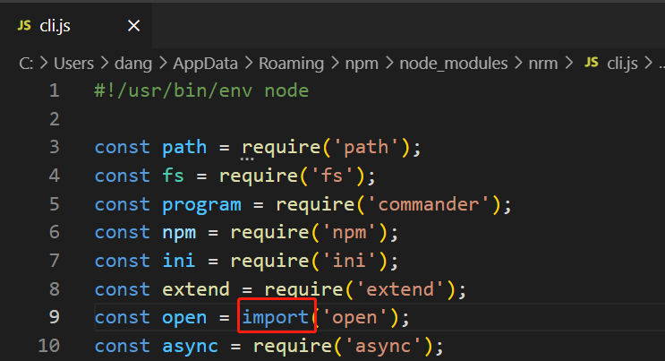

## 发布组件库到npm

1. 在`lib`文件夹下新建`package.json`文件

   ```json
   {
       "name": "imooc-element-components-dang", //组件库的名称
       "version": "1.0.0", //版本号
       "main": "index.umd.js",//入口文件。把mooc-element-components.umd.js改为index.umd.js
       "module": "index.es.js",//模块。把mooc-element-components.mjs改为index.es.js
       "types": "index.d.ts",//需要在lib文件夹下新建index.d.ts，代码如下
       "author": {
           "name": "dang"
       },
       "keywords": [
           "elements-plush",
           "ts",
           "封装组件",
           "二次封装",
           "vue-components"
       ]
   }
   ```

   `index.d.ts`代码。每个生成的组件，也需要添加这个`index.d.ts`

   ```typescript
   // 告诉使用我们当前组件库的项目
   // 我们这个组件库是一个vue插件
   
   import { App } from 'vue'
   declare const _default:{
       install(app:App):void
   }
   
   export default _default
   ```

2. 注册`npm` 账号

   ```javascript
   //我的账号
   dangly
   ```

   

3. 把lib文件夹的代码传到npm上

   - ```json
     // 在Lib文件夹下的终端路径
     npm login
     ```

     如果出现这个错误，就执行命令`npm config set registry https://registry.npmjs.org` 

     

     

     `npm who am i`可以查看当前登录用户

     

   - 执行`npm publish`

     如果报出以下错误：

     

     解决办法：

     本项目的出错是`package.json`的`name`不是唯一的，被其他人发布过。所以修改一下`name`的值就可以。

     

     再次执行 `npm publish`

     

     

   - 考虑到我们`npm` 下载时候需要淘宝镜像，所以需要在镜像间切换，可以使用nrm进行快速切换，也可以使用命令切换。

     ​	1、使用nrm切换镜像源

        ```javascript
        //全局安装 nrm小工具
        npm install -g nrm 
        //查看nrm版本号，若正常出现版本号则安装成功，否则安装失败
        npm --version
        //查看可切换的镜像源： (*表示正在使用的镜像源)
        nrm ls
        
         //切换源
         nrm use taobao
         nrm use npm
        ```

     若查看nrm版本号时，出现以下报错：

     
     
     解决办法：根据提示的文件路径，打开cli.js。修改为：const open = import('open');

     

     ​	2、镜像源的切换
     
     ​	将 npm设置成国内的淘宝镜像，在终端中执行以下命令：
  
        ```javascript
        npm config set registry  https://registry.npm.taobao.org/  #设置淘宝镜像地址
        ```
     
        ​	设置为官方镜像：
     
        ```javascript
        npm config set registry https://registry.npmjs.org/
        ```
   
    ```javascript
    npm config get registry //查看当前镜像地址
    ```

## 更新组件库

1. 新增`demo`文件夹：把`package.json`和`index.d.ts`复制到文件夹下

2. 执行命令：

   ```javascript
   npm run lib
   ```

3. 删除生成的`utils`文件夹

4. 把`demo`中的`package.json`复制到Lib文件夹下，把`index.d.ts`每个文件夹下都需要添加

5. `package.json`版本加1

6. 执行

   ```javascript
   npm run publish
   ```

## 测试发布的组件库

1. 创建新项目

   ```javascript
   npm init vite@latest my-vue-app -- -- template vue-ts
   ```

   代码放在github上，地址：

   [[helloDangliyi/my-vue-app: 这是一个测试项目：主要是为了测试imooc-element-components-dang组件库发布后，在项目的引入是否成功。具体过程可查看文档： (github.com)](https://github.com/helloDangliyi/my-vue-app)](https://github.com/helloDangliyi/my-vue-app)

2. 安装依赖

   ```javascript
   npm i 
   
   npm i -D element-plus @element-plus/icons-vue
   
   npm i imooc-element-components-dang -s
   ```

   在`package.json`中可以看到

   ```javascript
   {
   ...
   "dependencies": {
       "imooc-element-components-dang": "^1.0.0",
     },
   }
   ```

   `main.ts`中引入:

   ```typescript
   ...
   
   import ElementPlus from 'element-plus'
   import 'element-plus/dist/index.css'
   //全部引入
   import mUI from 'imooc-element-components-dang'
   import 'imooc-element-components-dang/style.css'
   
   // 单独引入
   //import  chooseIcon from 'imooc-element-components-dang/chooseIcon'
   //import 'imooc-element-components-dang/chooseIcon/style.css'
   
   const app = createApp(App)
   app.use(ElementPlus)
   .use(mUI)
   //.use(chooseIcon)
   app.mount('#app')
   ```

   