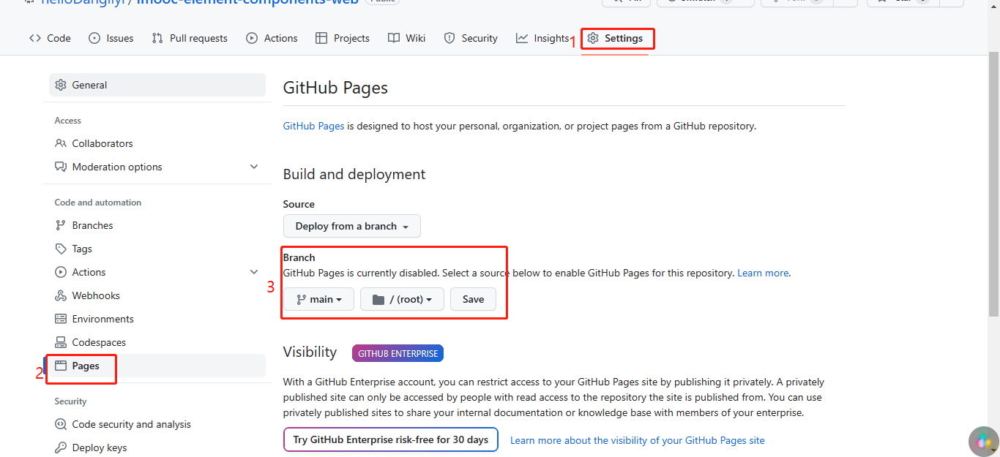
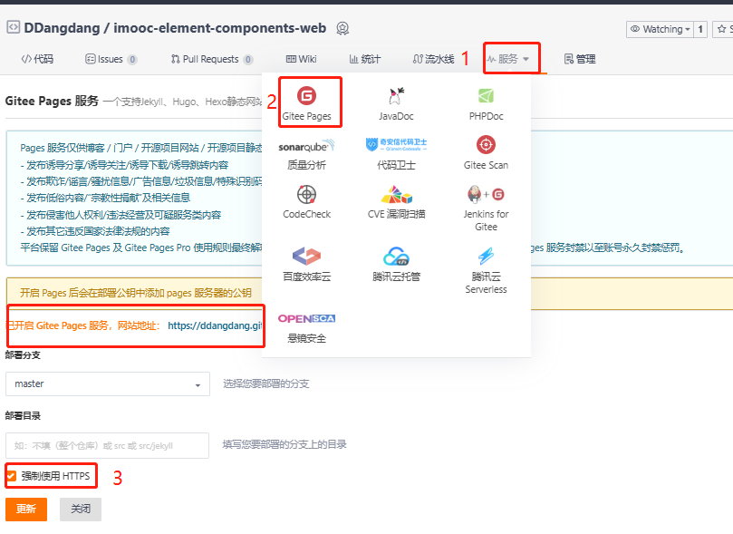

## 打包

1. `main.ts`中组件库的引入方式改为:

   ```
   import mUI from './components/index'
   ```

2. `router/index.ts`中，路由模式改为哈希路由

   ```typescript
   import { createWebHashHistory } from 'vue-router'
   
   const router = createRouter({
       routes,
       history: createWebHashHistory()
   })
   ```

   

3. 执行命令`npm run build`,对整个Vue项目进行打包，而不是像执行`npm run lib`那样打包成一个库

## 部署到github

1. 新增一个`github`仓库

   仓库名称：imooc-element-components-web

   描述：imooc-element-components在线演示网站

2. 复制`dist`文件夹在桌面，分别为`dist`、`dist2`

3. `dist`文件上传到`github`

   ```
   git init
   git add.
   git commit -m "注释"
   git branch -M main
   git remote add origin git@github.com:helloDangliyi/imooc-element-components-web.git
   git push -u origin main
   ```

4. 刷新github就可以看见已经上传成功了。

5. 配置静态页面

   

6. 保存后就可以看见部署后的网址了。

## 部署到码云

1. 新增一个码云仓库

   仓库名称：imooc-element-components-web

   描述：imooc-element-components在线演示网站

2. `dist2`文件夹路径下

   ```
   git init
   git add.
   git commit -m "注释"
   git remote add origin https://gitee.com/DDangdang/imooc-element-components-web.git
   git push -u origin "master"
   ```
   
12. 可以在服务中使用gieetPages

    

13. 保存后就可以出现一个网站地址。