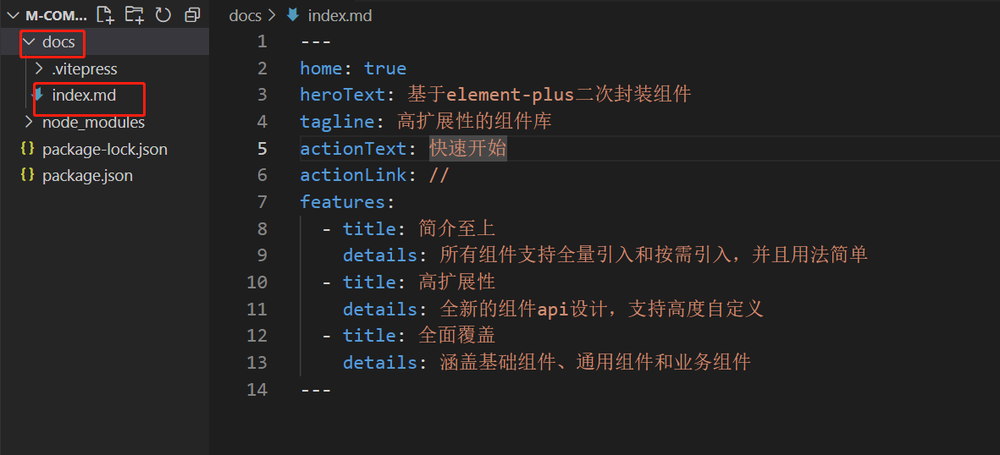

## 快速上手

1. 创建并进入一个目录

   ```
   mkdir m-compoents-blog && cd m-compoents-blog
   ```

   

2. 初始化:生成一个`package.json`文件

   ```
   npm init -y
   ```

   

3. 开发依赖安装VitePress

   ```
   npm i -D VitePress
   ```

4. 在 `package.json`.添加一些`script`

   ```
   {
     "scripts": {
       "dev": "vitepress dev docs",
       "build": "vitepress build docs",
       "serve": "vitepress serve docs"
     }
   }
   ```

5. 编写首页`index.md`

   首页代码如下：

   ```markdown
   ---
   home: true
   heroText: 基于element-plus二次封装组件
   tagline: 高扩展性的组件库
   actionText: 快速开始
   actionLink: //
   features:
     - title: 简介至上
       details: 所有组件支持全量引入和按需引入，并且用法简单
     - title: 高扩展性
       details: 全新的组件api设计，支持高度自定义
     - title: 全面覆盖
       details: 涵盖基础组件、通用组件和业务组件
   ---
   ```

6. 执行命令

   ```
   npm run dev
   ```

## 编写网站头部和侧边导航

   在`docs/.vitepress`下新建文件`config.json`,可以进行配置

## 集成组件库并添加显示和交互

   1. 在`docs/.vitepress`下新建文件夹`theme/index.js`

      ```javascript
      import DefaultTheme  from "vitepress/theme";
      import ElementPlus from 'element-plus'
      import 'element-plus/dist/index.css'
      
      // 全局引入
      import mUI from 'imooc-element-components-dang'
      import 'imooc-element-components-dang/style.css'
      
      export  default{
          ...DefaultTheme,
          enhanceApp({app}){
              app.use(ElementPlus)
              app.use(mUI)
          }
      }
      ```

      

   2. 执行命令

      ```
      npm i -D element-plus @element-plus/icons-vue imooc-element-components-dang
      ```

   3. 可以编写组件对应的文档。格式如图标选择器文档