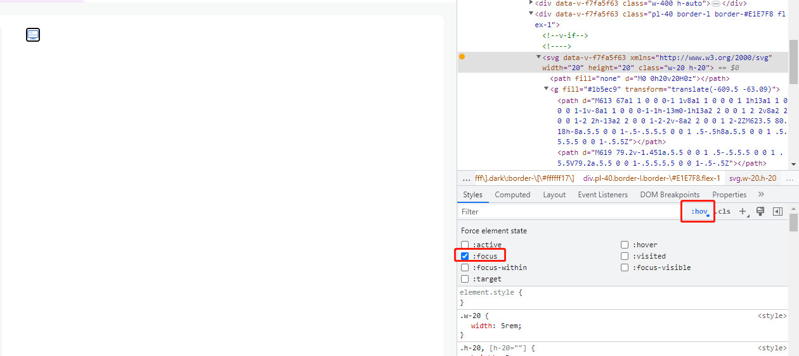

#### 当把 `svg` 图片放到 `n-tooltip` 组件中点击时，`svg` 的聚焦样式就会显示出边框。

```vue
<template>
  <n-tooltip trigger="hover">
    <template #trigger>
      <component :is="pcMenuSvg" class="w-20 h-20"></component>
    </template>
    如果它长得像鸭子，走起来像鸭子，叫起来也像鸭子，那它一定是个鸭子。
  </n-tooltip>
</template>

<script setup>
import pcMenuSvg from "@/assets/svg/pcmenu.svg";
</script>
```

#### 浏览器显示：检查选中svg，并勾选上:focus时候，边框就会出现。



#### 解决办法：

```css
svg:focus {
  outline: none;
}
```

